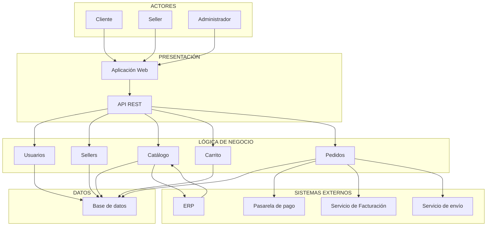

# Arquitectura inicial del sistema

## Marketplace de productos para mascotas

## Diagrama de arquitectura

## Descripción

La arquitectura inicial se organiza en tres capas principales:

- **Presentación:** permite la interacción de los clientes, sellers y administradores mediante la aplicación web y la API REST.
- **Lógica de negocio:** contiene los módulos de usuarios, sellers, catálogo, carrito y pedidos, responsables de implementar las principales funcionalidades del Marketplace.
- **Datos:** contiene la base de datos utilizada para almacenar y consultar la información del sistema.

Además, la arquitectura contempla la integración con sistemas externos:

- **Pasarela de pago:** procesa los pagos de los pedidos.
- **Servicio de facturación:** genera los comprobantes de pago.
- **Servicio de envío:** gestiona la información relacionada con la entrega.
- **ERP:** proporciona información de productos y stock.